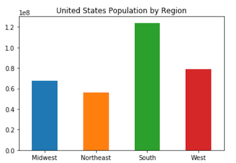
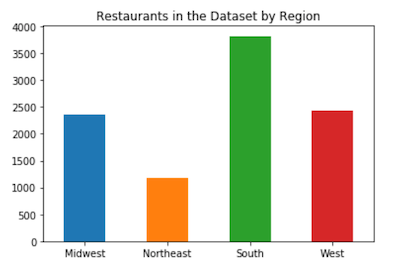

# U.S. Fast Food Industry Web Visualization Project
## Team Members
[Lynn Leifker](https://github.com/LBBL96/): Python Analysis, Data Cleaning, JavaScript Visualization, D3, Project Writeup

[Jorge Cavazos](https://github.com/Jcavazosg/): SQLite Database, Web Design, HTML, Flask, Website Deployment

[Cynthia Juarez](https://github.com/juarezCynthia3/): Data Gathering and Cleaning, Excel, Tableau Visualization

[Kellye Rennell](https://github.com/KellyeRennell/): Research, JavaScript Visualization, D3, PowerPoint 

## Data Gathering
Using a free portion of Datafiniti's [Fast Food Restaurant Database](https://www.kaggle.com/datafiniti/fast-food-restaurants/), we pulled a dataset of 10,000 rows of fast-food restaurant data that included information on restaurant location and category. A report from [QSR](https://www.qsrmagazine.com/reports/qsr50-2016-top-50-chart) provided total restaurant sales by chain for 2016.

## Data Cleaning
Using a combination of Excel and Python, we removed one-off restaurants from the dataset so that we could focus on location of restaurant chains. From this granular data, we created categories by zip code, state, and region of the United States to be able to 1) map restaurants and 2) draw conclusions about fast food popularity within various regions. Comparison of the larger dataset with overall trends shown in the QSR report allowed us to draw some conclusions about the accuracy of the sampled 10,000 restaurants.

## Database
Once the data was clean and ready to use for visualizations, we put it into a SQLite database. After deployment, the website was able to populate interactive JavaScript visualizations from the database.

## Tableau Visualizations (Full Dashboard [Here](https://public.tableau.com/profile/cynthia8750#!/vizhome/FastFoodRestaurants_15752771722250/Dashboard2))

### Density of McDonalds in the United States

### Fast Food Favorites in Texas

## Data Analysis
Exploratory data analysis [here](Project_Resources/Jupyter_Notebooks/Fast_Food_Analysis.ipynb) and [here](Project_Resources/Jupyter_Notebooks/Graphic_Data_Analysis.ipynb) allowed us see if any correlation exists between number and type of restaurants in an area and demographic factors such as obesity rate, income, and povert level. None of the correlations proved to be statistically significant, so we focused instead on where different types of restaurants are located and what that might tells us about a population's preferences.

According to one 2016 study, the United States had roughly 241,000 fast food restaurants in 2016. Our dataset of 10,000 restaurants represented roughly 4 percent of all restaurants. While this is not a large percentage, it is statistically significant enough to draw some conclusions about the overall population.

A look at U.S. population by region compared with the number of restaurants in each region appeared proportionate.

 

## Unexpected Results

created web visualizations using Tableau, D3, Python plots, and deployed our Flask app to Heroku.

With the U.S. having roughly 241,000 total fast food restaurants, according to one 2016 dataset, the restaurants and categories of focus for this project were:

* Burgers, Sandwiches, Ethnic, Pizza, Snacks, Chicken, Seafood

* Starbucks, Chik-Fil-A, McDonald's, Taco Bell, Burger King, Arby's, Wendys, Jack in the Box, Pizza Hut, Dairy Queen
